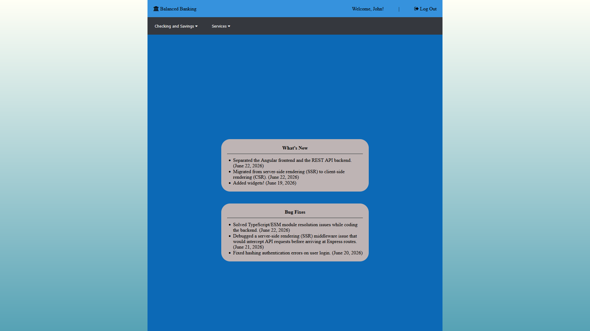
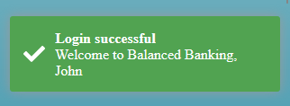

# Banking Simulation

## Summary

Building a full-stack banking application which supports fund transfers, account creation and management, deposits, and withdrawals.

## Tech Stack

- Angular
- TypeScript
- Node.js
- Express
- MongoDB

This project was generated using [Angular CLI](https://github.com/angular/angular-cli) version 21.2.15.

## Development server

1. Install necessary dependencies:

```bash
npm install
```

2. Start the local development server:

```bash
ng serve
```

3. Run the API service on a separate terminal with:
```bash
npm run server
```

Once the server is running, open your browser and navigate to `http://localhost:4200/`. The application will automatically reload whenever you modify any of the source files.

## Screenshots

Preview of the home page after successfully logging in. (Progress update as of June 22, 2026)


When the user successfully logs in with the correct credentials, a toast notification will pop up on the screen.


## Building

To build the project run:

```bash
ng build
```

This will compile your project and store the build artifacts in the `dist/` directory. By default, the production build optimizes your application for performance and speed.

## Running unit tests

To execute unit tests with the [Vitest](https://vitest.dev/) test runner, use the following command:

```bash
ng test
```

## Running end-to-end tests

For end-to-end (e2e) testing, run:

```bash
ng e2e
```

Angular CLI does not come with an end-to-end testing framework by default. You can choose one that suits your needs.

## Additional Resources

For more information on using the Angular CLI, including detailed command references, visit the [Angular CLI Overview and Command Reference](https://angular.dev/tools/cli) page.
