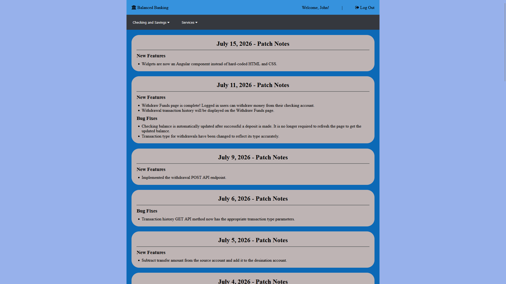
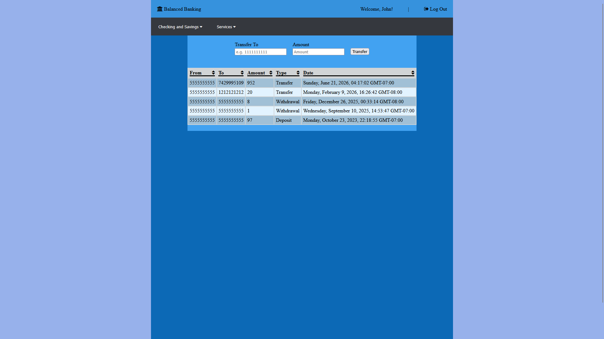
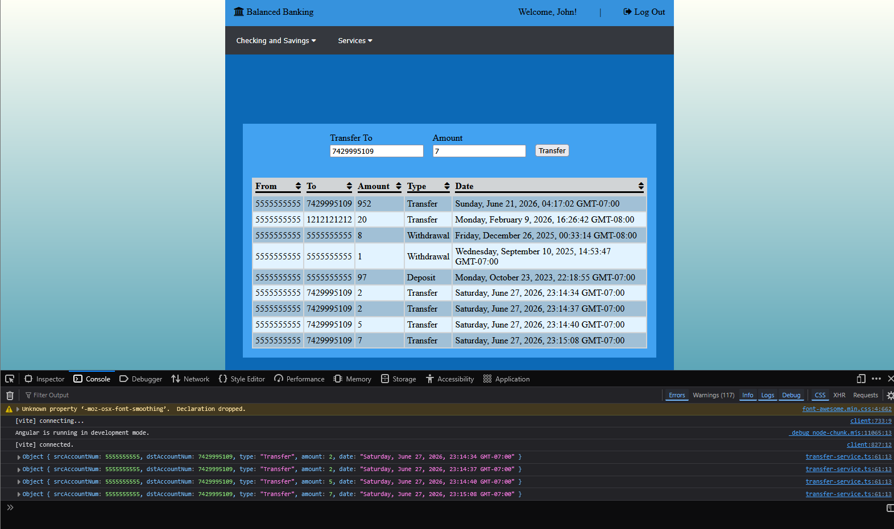
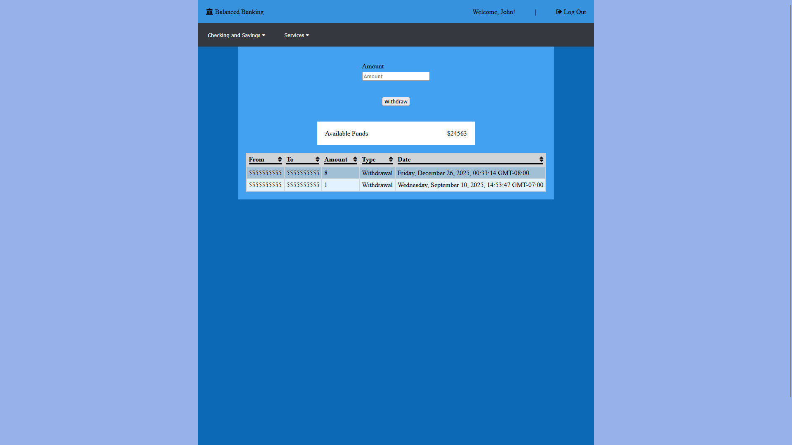
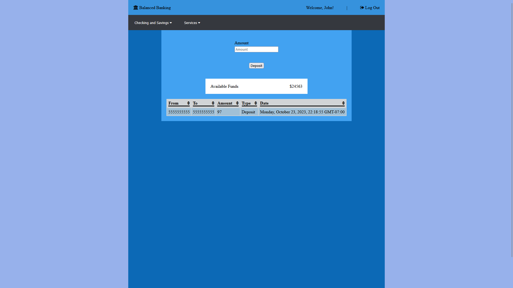
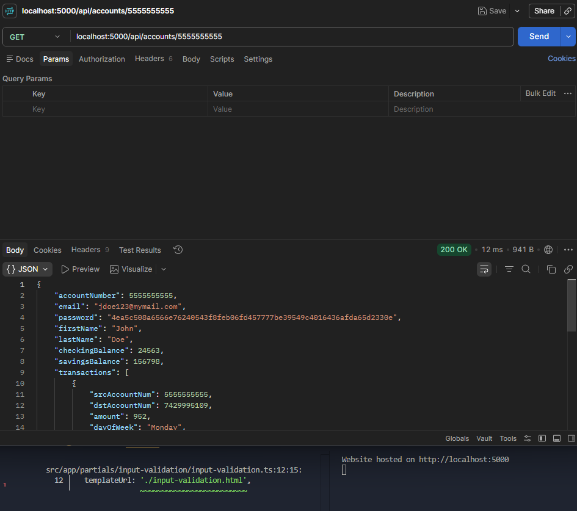
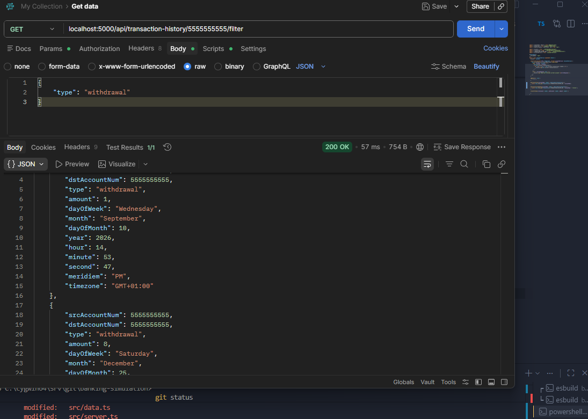

# Banking Simulation

## Summary

Building a full-stack banking application which supports fund transfers, account creation and management, deposits, withdrawals, and fund transfers between accounts.

## Tech Stack

- Angular
- TypeScript
- Node.js
- Express
- MongoDB

This project was generated using [Angular CLI](https://github.com/angular/angular-cli) version 21.2.15.

## Screenshots

Preview of the home page after successfully logging in. (Progress update as of July 11, 2026)


When the user successfully logs in with the correct credentials, a toast notification will pop up on the screen.


Progress update of the fund transfer page, which dynamically populates transaction history received from the backend API (As of July 15, 2026).


Progress update of successful fund transfer to a valid destination account (As of June 27, 2026).


Withdraw page progress update (As of July 15, 2026).


Deposit page progress update (As of July 15, 2026).


Postman successful response to GET request searching for an account by its account number.


Postman successful response to GET request retrieving only withdrawals.


## Development server

1. Install necessary dependencies:

```bash
npm install
```

2. Start the local development server:

```bash
ng serve
```

3. Run the API server on a separate terminal with:
```bash
npm run server
```
- NOTE: the API server requires a generated secret key.
Create a `credentials.ts` file in the `src/` folder.
Generate a secret key and export it from the `credentials.ts` file:
    ```
    export const secretKey = "SomeSecretKey";
    ```

Once the server is running, open your browser and navigate to `http://localhost:4200/`. The application will automatically reload whenever you modify any of the source files.

## Building

To build the project run:

```bash
ng build
```

This will compile your project and store the build artifacts in the `dist/` directory. By default, the production build optimizes your application for performance and speed.

## Running unit tests

To execute unit tests with the [Vitest](https://vitest.dev/) test runner, use the following command:

```bash
ng test
```

## Running end-to-end tests

For end-to-end (e2e) testing, run:

```bash
ng e2e
```

Angular CLI does not come with an end-to-end testing framework by default. You can choose one that suits your needs.

## Additional Resources

For more information on using the Angular CLI, including detailed command references, visit the [Angular CLI Overview and Command Reference](https://angular.dev/tools/cli) page.
